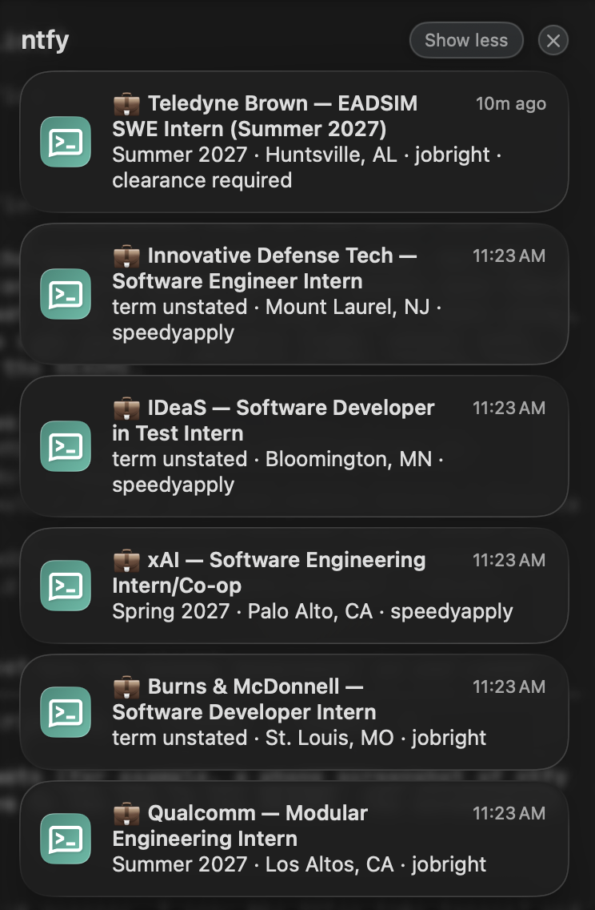
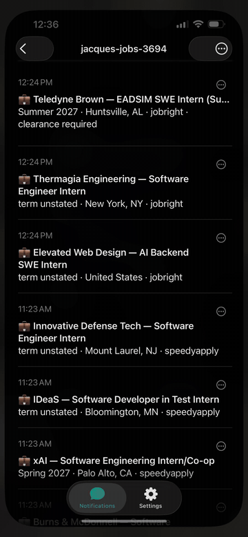

<!-- Last edited: 2026-10-03 13:35 CDT -->

<a id="readme-top"></a>

[![Contributors][contributors-shield]][contributors-url]
[![Forks][forks-shield]][forks-url]
[![Stargazers][stars-shield]][stars-url]
[![Issues][issues-shield]][issues-url]
[![MIT License][license-shield]][license-url]

<br />
<div align="center">

<h3 align="center">job-watcher</h3>

  <p align="center">
    A push notification on your phone for each new software internship, within about an hour of when it shows up on a public list.
    <br />
    <a href="docs/job_watcher_plan.md"><strong>Explore the design doc »</strong></a>
    <br />
    <br />
    <a href="#usage">Subscribe to alerts</a>
    &middot;
    <a href="https://github.com/JacquesAttinger/job-watcher/issues/new?labels=bug">Report Bug</a>
    &middot;
    <a href="https://github.com/JacquesAttinger/job-watcher/issues/new?labels=enhancement">Request a Source</a>
  </p>
</div>

<details>
  <summary>Table of Contents</summary>
  <ol>
    <li>
      <a href="#about-the-project">About The Project</a>
      <ul>
        <li><a href="#how-it-works">How It Works</a></li>
        <li><a href="#built-with">Built With</a></li>
      </ul>
    </li>
    <li><a href="#usage">Usage</a></li>
    <li>
      <a href="#getting-started">Getting Started</a>
      <ul>
        <li><a href="#prerequisites">Prerequisites</a></li>
        <li><a href="#installation">Installation</a></li>
        <li><a href="#deploy-as-a-cloud-routine">Deploy as a Cloud Routine</a></li>
      </ul>
    </li>
    <li><a href="#roadmap">Roadmap</a></li>
    <li><a href="#contributing">Contributing</a></li>
    <li><a href="#license">License</a></li>
    <li><a href="#contact">Contact</a></li>
    <li><a href="#acknowledgments">Acknowledgments</a></li>
  </ol>
</details>

## About The Project

<div align="center">
  
</div>

Early applicants get seen first.
Most internship postings get hundreds of applications within days, so the first 24–48 hours matter a lot.
Checking six different lists by hand, all day, is tedious and easy to forget.
job-watcher watches them for you and only interrupts you when a real match shows up.

Once an hour, a [Claude cloud routine](https://code.claude.com/docs/en/routines) checks six community-maintained internship lists.
For each new posting that fits, it sends one push notification through [ntfy](https://ntfy.sh).
The routine runs in Anthropic's cloud on a Claude subscription, so no computer has to stay on, and it never bills per token.

It watches these lists:

| Source | Feed |
|---|---|
| [SimplifyJobs/Summer2027-Internships](https://github.com/SimplifyJobs/Summer2027-Internships) | `.github/scripts/listings.json` |
| [zshah101/Automated-List-Of-Summer-2027-and-Fall-2026-Tech-Internships](https://github.com/zshah101/Automated-List-Of-Summer-2027-and-Fall-2026-Tech-Internships) | `docs/api/jobs.json` |
| [jobright-ai/2026-Software-Engineer-Internship](https://github.com/jobright-ai/2026-Software-Engineer-Internship) | `README.md` table |
| [speedyapply/2027-SWE-College-Jobs](https://github.com/speedyapply/2027-SWE-College-Jobs) | `README.md` table |
| [Chieler/Summer-2027-SWE-Internships](https://github.com/Chieler/Summer-2027-SWE-Internships) | `README.md` table (it collects from several boards; cross-source dedupe removes the overlap) |
| [ApplyGuy/2027-Internships](https://github.com/ApplyGuy/2027-Internships) | `data/internships.json` |

<p align="right">(<a href="#readme-top">back to top</a>)</p>

### How It Works

1. `python -m watcher.cli scan` downloads the feeds and drops every posting that is already in `state/seen.json`.
   Then it applies the hard exclusions in `watcher/filters.py` and writes the remaining candidates to `state/pending.json`.
2. Claude reads `pending.json`, decides for each candidate, and writes `state/decisions.json`.
3. `python -m watcher.cli send` pushes one ntfy message for each kept posting (8 at most, then one "and N more" message).
   It also appends to `alerts.csv`, writes `runs/<stamp>.md`, marks every new key as seen, commits to `main`, and pings [healthchecks.io](https://healthchecks.io).

If step 2 does not happen, step 3 refuses to run, so nothing is marked as seen without a decision.

All state lives in this repo as plain files (`state/seen.json`, `alerts.csv`, `runs/`).
Each run commits them, so the repo has no database.
The full design, with each decision and the reason for it, is in [`docs/job_watcher_plan.md`](docs/job_watcher_plan.md).

<p align="right">(<a href="#readme-top">back to top</a>)</p>

### Built With

* [![Python][Python-badge]][Python-url] 3.11, standard library only, with no runtime dependencies to install or trust
* [![Claude][Claude-badge]][Claude-url] cloud routine that decides for each posting and writes the alert text
* [![ntfy][ntfy-badge]][ntfy-url] for push notifications
* [![healthchecks.io][healthchecks-badge]][healthchecks-url] dead-man's switch that alerts you if an hourly run does not report
* [![pytest][pytest-badge]][pytest-url] [![Ruff][Ruff-badge]][Ruff-url] [![pre-commit][pre-commit-badge]][pre-commit-url] for tests, lint, and format checks before each commit

<p align="right">(<a href="#readme-top">back to top</a>)</p>

## Usage

You do not need to install anything from this repo to get the alerts.

1. Install the [ntfy app](https://ntfy.sh) from the App Store or Google Play, or use the [web app](https://ntfy.sh/app).
2. Add a subscription to the topic `jacques-jobs-3694`.
3. You are done.
   New postings arrive as push notifications about once an hour, from 7am to 1am Central time.

<div align="center">
  
</div>

Each alert is one posting.
The title is `Company — Role`.
The body shows the term, the location, and the source.
A tap opens the application page.

This shared instance uses one set of filters.
It keeps internships and co-ops for Summer 2027, Fall 2026, or Winter 2027 (or no stated term) in software, AI/ML, data, or security engineering.
The roles must accept Bachelor's students and be in the US or remote in the US.
It drops quant, hardware, product, analyst, and PhD- or Master's-only roles.
If you want different filters, a different topic, or a different schedule, [run your own copy](#getting-started).

You can also get these messages on the topic:

* `job-watcher: nothing new`: a quiet, low-priority message when a run finds no new match. It shows that the watcher is still running.
* `job-watcher: <source> failed`: at most once a day for each source.
* `job-watcher is silent`: from healthchecks.io when no run reports on schedule.

<p align="right">(<a href="#readme-top">back to top</a>)</p>

## Getting Started

Use these steps to run your own copy, with your own topic, filters, and schedule.

### Prerequisites

* Python 3.11 or later
* The [ntfy app](https://ntfy.sh) on your phone, subscribed to a long random topic name of your choice
* A Claude subscription with [cloud routines](https://code.claude.com/docs/en/routines), for the hourly cloud runs
* Optional: a free [healthchecks.io](https://healthchecks.io) check, so you know if the runs stop

### Installation

1. Fork the repo, then clone your fork.
   ```sh
   git clone https://github.com/<your-username>/job-watcher.git
   cd job-watcher
   ```
2. Create a virtual environment and install the dev tools.
   ```sh
   python3 -m venv .venv && .venv/bin/pip install -e ".[dev]"
   .venv/bin/pre-commit install
   ```
3. Copy the example environment file, then fill in `NTFY_TOPIC` and (optional) `HC_PING_URL`.
   ```sh
   cp .env.example .env
   ```
4. Send one test push to your phone, then look at what is new.
   ```sh
   .venv/bin/python -m watcher.cli test             # one push to your phone
   .venv/bin/python -m watcher.cli scan             # see what is new
   .venv/bin/python -m watcher.cli send --dry-run   # print what would be sent
   .venv/bin/python -m pytest -q
   ```
5. Change the filters in `watcher/filters.py` and the profile in `routine/PROMPT.md` so they match the roles you want.

**First run (bootstrap).**
When `state/seen.json` does not exist, `scan` marks all postings as seen and `send` pushes one "job-watcher armed" message.
Real alerts start on the next run.
`python -m watcher.cli seed` does both steps.

### Deploy as a Cloud Routine

The section "Routine configuration" in [`docs/job_watcher_plan.md`](docs/job_watcher_plan.md#routine-configuration) has the full setup.
In short:

1. Create a cloud environment with `ntfy.sh` and `hc-ping.com` added to the allowed domains.
   Set `NTFY_TOPIC` and `HC_PING_URL` as environment variables.
2. Create a routine on your fork's `main` branch, paste in `routine/PROMPT.md`, and remove all connectors.
3. Set an hourly cron schedule, then use **Run now** with the text `test` to make sure your phone gets a push.

**Changing the watcher later.**
Edit `watcher/filters.py` or `routine/PROMPT.md`, open a PR, and merge it to `main`.
Each scheduled run clones `main` again, so it uses the change automatically.
If you changed the routine prompt, also paste the new `routine/PROMPT.md` into the routine at [claude.ai/code/routines](https://claude.ai/code/routines).

<p align="right">(<a href="#readme-top">back to top</a>)</p>

## Roadmap

- [ ] Add more internship lists (suggestions are welcome, see [Contributing](#contributing))
- [ ] Make a tailored resume for each alerted posting

See the [open issues](https://github.com/JacquesAttinger/job-watcher/issues) for the full list of proposed features and known issues.

<p align="right">(<a href="#readme-top">back to top</a>)</p>

## Contributing

Issues and pull requests are both welcome.

**Know another internship list that this should watch?**
Open an [issue](https://github.com/JacquesAttinger/job-watcher/issues/new?labels=enhancement) with a link to it.

**Want to add it yourself?**

1. Fork the project.
2. Create a branch (`git checkout -b add-source/<name>`).
3. Add a fetcher to `watcher/sources.py`, a small sample feed to `tests/fixtures/`, and a test to `tests/test_sources.py`.
4. Commit your changes.
   The pre-commit hook runs `ruff` and `pytest`.
5. Push the branch and open a pull request.

[`docs/job_watcher_plan.md`](docs/job_watcher_plan.md) explains how the existing sources are connected.

### Top contributors:

<a href="https://github.com/JacquesAttinger/job-watcher/graphs/contributors">
  
</a>

<p align="right">(<a href="#readme-top">back to top</a>)</p>

## License

Distributed under the MIT License.
See [`LICENSE`](LICENSE) for more information.

<p align="right">(<a href="#readme-top">back to top</a>)</p>

## Contact

Jacques Attinger - [@JacquesAttinger](https://github.com/JacquesAttinger) on GitHub

Project Link: [https://github.com/JacquesAttinger/job-watcher](https://github.com/JacquesAttinger/job-watcher)

<p align="right">(<a href="#readme-top">back to top</a>)</p>

## Acknowledgments

* The maintainers of the six internship lists above. This project only reads what they collect.
* [ntfy](https://ntfy.sh) and [healthchecks.io](https://healthchecks.io), for free and simple push notifications and run monitoring
* [Best-README-Template](https://github.com/othneildrew/Best-README-Template), for the structure of this README

<p align="right">(<a href="#readme-top">back to top</a>)</p>

[contributors-shield]: https://img.shields.io/github/contributors/JacquesAttinger/job-watcher.svg?style=for-the-badge
[contributors-url]: https://github.com/JacquesAttinger/job-watcher/graphs/contributors
[forks-shield]: https://img.shields.io/github/forks/JacquesAttinger/job-watcher.svg?style=for-the-badge
[forks-url]: https://github.com/JacquesAttinger/job-watcher/network/members
[stars-shield]: https://img.shields.io/github/stars/JacquesAttinger/job-watcher.svg?style=for-the-badge
[stars-url]: https://github.com/JacquesAttinger/job-watcher/stargazers
[issues-shield]: https://img.shields.io/github/issues/JacquesAttinger/job-watcher.svg?style=for-the-badge
[issues-url]: https://github.com/JacquesAttinger/job-watcher/issues
[license-shield]: https://img.shields.io/github/license/JacquesAttinger/job-watcher.svg?style=for-the-badge
[license-url]: https://github.com/JacquesAttinger/job-watcher/blob/main/LICENSE
[Python-badge]: https://img.shields.io/badge/Python-3776AB?style=for-the-badge&logo=python&logoColor=white
[Python-url]: https://www.python.org/
[Claude-badge]: https://img.shields.io/badge/Claude-D97757?style=for-the-badge&logo=claude&logoColor=white
[Claude-url]: https://code.claude.com/docs/en/routines
[ntfy-badge]: https://img.shields.io/badge/ntfy-317F6F?style=for-the-badge&logo=ntfy&logoColor=white
[ntfy-url]: https://ntfy.sh
[pytest-badge]: https://img.shields.io/badge/pytest-0A9EDC?style=for-the-badge&logo=pytest&logoColor=white
[pytest-url]: https://pytest.org
[Ruff-badge]: https://img.shields.io/badge/Ruff-D7FF64?style=for-the-badge&logo=ruff&logoColor=black
[Ruff-url]: https://docs.astral.sh/ruff/
[pre-commit-badge]: https://img.shields.io/badge/pre--commit-FAB040?style=for-the-badge&logo=precommit&logoColor=black
[pre-commit-url]: https://pre-commit.com
[healthchecks-badge]: https://img.shields.io/badge/healthchecks.io-64748B?style=for-the-badge
[healthchecks-url]: https://healthchecks.io
